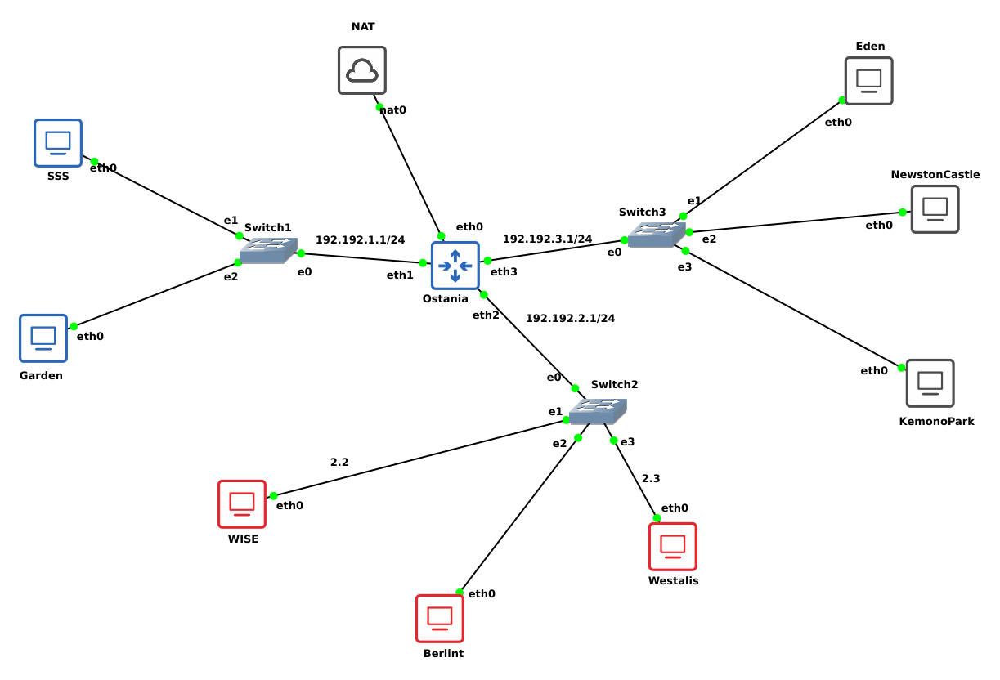
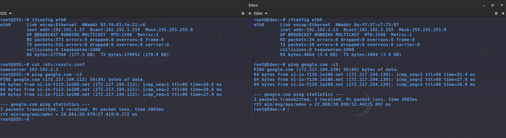

# Jarkom-Modul-3-D14-2022

Lapres Praktikum Jarkom Modul 3 Kelompok D-14

| Nama                      | NRP      |
|---------------------------|----------|
|Gloriyano C. Daniel Pepuho |5025201121|



## Cara Pengerjaan

### Nomor 1 & 2
Loid bersama Franky berencana membuat peta tersebut dengan kriteria WISE sebagai DNS Server, Westalis sebagai DHCP Server, Berlint sebagai Proxy Server, dan Ostania sebagai DHCP Relay . Loid dan Franky menyusun peta tersebut dengan hati-hati dan teliti.

Pertama **Konfigurasi IP Address terlebih dahulu**

* Ostania (DHCP Relay)
```

auto eth0
iface eth0 inet static
	address 192.168.122.222
	netmask 255.255.255.0
	gateway 192.168.122.1

auto eth1
iface eth1 inet static
	address 192.192.1.1
	netmask 255.255.255.0

auto eth2
iface eth2 inet static
	address 192.192.2.1
	netmask 255.255.255.0


auto eth3
iface eth3 inet static
	address 192.192.3.1
	netmask 255.255.255.0

```

* Westalis (DHCP Server)

```

auto eth0
iface eth0 inet static
	address 192.192.2.3
	netmask 255.255.255.0
	gateway 192.192.2.1
	up echo nameserver 192.168.122.1 > /etc/resolv.conf
```

* WISE (DNS Server)

```

auto eth0
iface eth0 inet static
	address 192.192.2.2
	netmask 255.255.255.0
	gateway 192.192.2.1
	up echo nameserver 192.168.122.1 > /etc/resolv.conf
```

* Berlint (Proxy Server)

```
auto eth0
iface eth0 inet static
	address 192.192.2.4
	netmask 255.255.255.0
	gateway 192.192.2.1
    up echo nameserver 192.168.122.1 > /etc/resolv.conf


```

Untuk akses internet, tambahkan konfigurasi nameserver di **/etc/resolv.conf** dan juga konfiogurasi **iptables** pada router Ostania agar node-node yang terhubung bisa mengakses internet juga.

```

echo "nameserver 192.168.122.1" >> /etc/resolv.conf
iptables -t nat -A POSTROUTING -o eth0 -j MASQUERADE -s 192.192.0.0/16

```

**Instalasi**

* Ostania

```

apt update
apt-get install isc-dhcp-relay -y

```

* Westalis

```

apt update
apt-get install isc-dhcp-server -y

```

* WISE

```

apt update
apt-get install bind9 -y

```

* Berlint

```

apt update
apt-get install squid -y
apt-get install  php libapache2-mod-php7.0 -y

```

### Nomor 3 & 4
Ada beberapa kriteria yang ingin dibuat oleh Loid dan Franky, yaitu:
- Semua client yang ada HARUS menggunakan konfigurasi IP dari DHCP Server.
- Client yang melalui Switch1 mendapatkan range IP dari [prefix IP].1.50 - [prefix IP].1.88 dan [prefix IP].1.120 - [prefix  IP].1.155
- Client yang melalui Switch3 mendapatkan range IP dari [prefix IP].3.10 - [prefix IP].3.30 dan [prefix IP].3.60 - [prefix IP].3.85


**Konfigurasi**

* Westalis, konfigurasi DHCP server, edit di **/etc/dhcp/dhcpd.conf**

```
subnet 192.192.1.0 netmask 255.255.255.0 {
    range 192.192.1.50 192.192.1.88;
    range 192.192.1.120 192.192.1.155;
    option routers 192.192.1.1;
    option broadcast-address 192.192.1.255;
}
subnet 192.192.2.0 netmask 255.255.255.0 {
}
subnet 192.192.3.0 netmask 255.255.255.0 {
    range 192.192.3.10 192.192.3.30;
    range 192.192.3.60 192.192.3.85;
    option routers 192.192.3.1;
    option broadcast-address 192.192.3.255;
}
```

* Ostania, konfigurasi DHCP relay untuk interface yang mengarah ke switch1 dan switch3, edit di **/etc/default/isc-dhcp-relay**

```

SERVERS="192.192.2.3" # IP Westalis
INTERFACES="eth1 eth2 eth3"

```

Kemudian uncomment **#net.ipv4.ip_forward=1** untuk meng-enable IP Forwarding di **/etc/sysctl.conf**. Untuk melihat konfigurasi IP Forward apakah sudah aktif atau belum bisa menggunakan perintah **cat /proc/sys/net/ipv4/ip_forward**, jika bernilai 1 berarti sudah aktif.

### Nomor 5
Client mendapatkan DNS dari WISE dan client dapat terhubung dengan internet melalui DNS tersebut.

* Westalis, tambahkan perintah **option domain-name-servers**, agar client bisa terhubung ke internet melalui DNS yang diberikan

```

subnet 192.192.1.0 netmask 255.255.255.0 {
    range 192.192.1.50 192.192.1.88;
    range 192.192.1.120 192.192.1.155;
    option routers 192.192.1.1;
    option broadcast-address 192.192.1.255;
    option domain-name-servers 192.192.2.2;
}
subnet 192.192.2.0 netmask 255.255.255.0 {
}
subnet 192.192.3.0 netmask 255.255.255.0 {
    range 192.192.3.10 192.192.3.30;
    range 192.192.3.60 192.192.3.85;
    option routers 192.192.3.1;
    option broadcast-address 192.192.3.255;
    option domain-name-servers 192.192.2.2;
}

```

* WISE, tambahkan konfigurasi untuk DNS option di **/etc/bind/named.conf.options**

```

options {
        directory "/var/cache/bind";
        forwarders {
            192.168.122.1;
        };
        allow-query{any;};
        auth-nxdomain no;    # conform to RFC1035
        listen-on-v6 { any; };
};

```

Untuk forwarders, IP yang digunakan yaitu IP NAT

### Nomor 6
Lama waktu DHCP server meminjamkan alamat IP kepada Client yang melalui Switch1 selama 5 menit sedangkan pada client yang melalui Switch3 selama 10 menit. Dengan waktu maksimal yang dialokasikan untuk peminjaman alamat IP selama 115 menit. (6)

* Westalis, tambahkan command **default-lease-time** untuk default waktu peminjaman IP ke client dan juga command **max-lease-time** untuk maksimal waktu untuk peminjaman IP ke client. Edit di **/etc/dhcp/dhcpd.conf**

```

subnet 192.192.1.0 netmask 255.255.255.0 {
    range 192.192.1.50 192.192.1.88;
    range 192.192.1.120 192.192.1.155;
    option routers 192.192.1.1;
    option broadcast-address 192.192.1.255;
    option domain-name-servers 192.192.2.2;
    default-lease-time 300;
    max-lease-time 6900;
}
subnet 192.192.2.0 netmask 255.255.255.0 {
}
subnet 192.192.3.0 netmask 255.255.255.0 {
    range 192.192.3.10 192.192.3.30;
    range 192.192.3.60 192.192.3.85;
    option routers 192.192.3.1;
    option broadcast-address 192.192.3.255;
    option domain-name-servers 192.192.2.2;
    default-lease-time 600;
    max-lease-time 6900;
}

```

### Nomor 7
Loid dan Franky berencana menjadikan Eden sebagai server untuk pertukaran informasi dengan alamat IP yang tetap dengan IP [prefix IP].3.13

* Ostania, tambahkan konfigurasi fixed address. Yang perlukan untuk fixed address pada DHCP yaitu nama host dari client dan juga MAC Address client dari interface yang terhubung. Tambahkan baris ini di **/etc/dhcp/dhcpd.conf**

```

host Eden {
    hardware ethernet 8a:ff:37:c7:73:97 ;
    fixed-address 192.192.3.13;
}

```

### Testing


Selanjutnya konfigurasi IP setiap node client menjadi DHCP.

```
auto eth0
iface eth0 inet dhcp
```
* Eden, agar MAC Address tidak berubah ketika node dimatikan tambahkan konfigurasi untuk hardware address. Edit di **/etc/network/interfaces**.

```
auto eth0
iface eth0 inet dhcp
        hwaddress ether 8a:ff:37:c7:73:97
```




